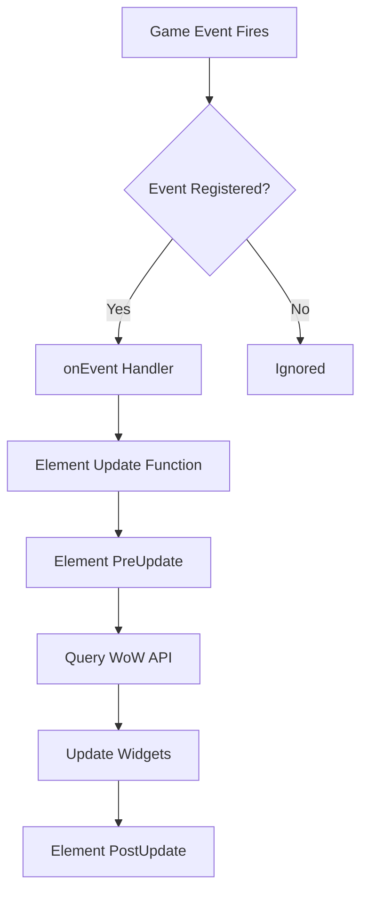

## Overview

oUF is built around a modular, event-driven architecture that separates concerns between frame management, styling, and data updates. Understanding this architecture is essential for creating effective layouts and custom elements.

## Core Components

### Frame Metatable

oUF extends the standard WoW frame object with custom methods through a metatable system:

```lua
local frame_metatable = {
    __index = CreateFrame('Button')
}
```

All oUF frames inherit from this metatable, gaining access to:
- Element management (`EnableElement`, `DisableElement`, `IsElementEnabled`)
- Update methods (`UpdateAllElements`)
- Unit watch methods (`Enable`, `Disable`, `IsEnabled`)

### Global State Management

oUF maintains several internal registries:

```lua
local styles = {}          -- Registered style functions
local style                -- Currently active style name
local callback = {}        -- Initialization callbacks
local objects = {}         -- All spawned unit frames
local headers = {}         -- All spawned group headers
local elements = {}        -- Registered elements
local activeElements = {}  -- Element state per frame
```

These registries enable:
- Style management across multiple layouts
- Element activation tracking
- Frame lifecycle management
- Init callback execution

## Frame Lifecycle

### 1. Style Registration

Styles must be registered before spawning frames:

```lua
oUF:RegisterStyle('MyLayout', function(self, unit)
    -- Style function that configures frame appearance
    self:SetSize(200, 50)
    -- Create and configure widgets...
end)

oUF:SetActiveStyle('MyLayout')
```

### 2. Frame Spawning

When `oUF:Spawn()` is called, the following sequence occurs:

```lua
function oUF:Spawn(unit, overrideName)
    -- 1. Create base frame with secure templates
    local object = CreateFrame('Button', name, parent, 'SecureUnitButtonTemplate, PingableUnitFrameTemplate')
    
    -- 2. Initialize unit tracking
    Private.UpdateUnits(object, unit)
    
    -- 3. Apply style function
    walkObject(object, unit)
    
    -- 4. Set unit attribute and register watch
    object:SetAttribute('unit', unit)
    RegisterUnitWatch(object)
    
    return object
end
```

### 3. Frame Initialization

The `initObject()` function performs critical setup:

```lua
local function initObject(unit, style, styleFunc, header, ...)
    -- Set metatable to gain oUF methods
    object = setmetatable(object, frame_metatable)
    
    -- Register core events
    object:RegisterEvent('PLAYER_ENTERING_WORLD', evalUnitAndUpdate, true)
    object:RegisterEvent('UNIT_ENTERED_VEHICLE', evalUnitAndUpdate)
    object:RegisterEvent('UNIT_EXITED_VEHICLE', evalUnitAndUpdate)
    
    -- Apply style function
    styleFunc(object, objectUnit, not header)
    
    -- Enable all registered elements
    activeElements[object] = {}
    for element in next, elements do
        object:EnableElement(element, objectUnit)
    end
    
    -- Execute init callbacks
    for _, func in next, callback do
        func(object)
    end
end
```

### 4. Element Activation

Elements are enabled automatically during initialization:

```lua
function frame:EnableElement(name, unit)
    local element = elements[name]
    if not element or self:IsElementEnabled(name) then return end
    
    -- Call element's enable function
    if element.enable(self, unit or self.unit) then
        -- Mark as active
        activeElements[self][name] = true
        
        -- Register update function
        if element.update then
            table.insert(self.__elements, element.update)
        end
    end
end
```

## Update Cycle

### Event-Driven Updates

oUF uses an event-driven model where game events trigger targeted updates:

```lua
local function onEvent(self, event, ...)
    if self:IsVisible() then
        return self[event](self, event, ...)
    end
end
```

When an event fires:
1. The event name is looked up as a method on the frame
2. Registered handler functions are called
3. Elements respond to their registered events

### Full Frame Updates

The `UpdateAllElements()` method forces all elements to update:

```lua
function frame:UpdateAllElements(event)
    if not unitExists(unit) then return end
    
    -- Pre-update callback
    if self.PreUpdate then
        self:PreUpdate(event)
    end
    
    -- Call all element update functions
    for _, func in next, self.__elements do
        func(self, event, unit)
    end
    
    -- Post-update callback
    if self.PostUpdate then
        self:PostUpdate(event)
    end
end
```

<Info>
The `__elements` table contains update functions from all enabled elements, allowing efficient iteration during full updates.
</Info>

### Unit Change Detection

When a unit changes (e.g., vehicle transitions), oUF automatically detects and updates:

```lua
local function updateActiveUnit(self, event)
    local realUnit, modUnit = SecureButton_GetUnit(self), SecureButton_GetModifiedUnit(self)
    
    -- Handle special unit rewrites
    if realUnit == 'playerpet' then
        realUnit = 'pet'
    end
    
    if modUnit == 'pet' and realUnit ~= 'pet' then
        modUnit = 'vehicle'
    end
    
    -- Update if unit changed
    if Private.UpdateUnits(self, modUnit, realUnit) then
        self:UpdateAllElements(event or 'RefreshUnit')
        return true
    end
end
```

## Unit Event System

oUF extends WoW's event registration with unit-aware filtering:

```lua
function frame:RegisterEvent(event, func, unitless)
    -- Standard events are registered as unit events
    if unitless or self.__eventless then
        registerEvent(self, event)
    else
        self.unitEvents = self.unitEvents or {}
        self.unitEvents[event] = true
        
        local unit1, unit2 = self.unit
        if unit1 and validateEventUnit(unit1) then
            registerUnitEvent(self, event, unit1, unit2 or '')
        end
    end
end
```

<Note>
Unit events are automatically re-registered when the frame's unit changes, ensuring events always fire for the correct unit.
</Note>

## Secure Frame Handling

oUF integrates with WoW's secure frame system for combat safety:

### Secure Templates

All frames use secure templates for click-casting:

```lua
-- Single frames
CreateFrame('Button', name, parent, 'SecureUnitButtonTemplate, PingableUnitFrameTemplate')

-- Group headers
header:SetAttribute('template', 'SecureUnitButtonTemplate, SecureHandlerStateTemplate, ...')
```

### Combat Lockdown Protection

The `resetParent()` function handles combat restrictions:

```lua
local function resetParent(self, parent)
    if parent ~= hiddenParent then
        if InCombatLockdown() and self:IsProtected() then
            -- Queue for after combat
            looseFrames[self] = true
        else
            self:SetParent(hiddenParent)
        end
    end
end
```

## Factory Pattern

The Factory system delays frame spawning until login:

```lua
function oUF:Factory(func)
    if IsLoggedIn() and factory.active then
        return func(self)
    else
        table.insert(queue, func)
    end
end
```

This ensures:
- All game data is available
- CVars are loaded
- Templates are registered

<Warning>
Always use `oUF:Factory()` to wrap your spawn code unless you have a specific reason to spawn frames earlier.
</Warning>

## PetBattle Frame Hider

oUF automatically hides frames during pet battles:

```lua
local PetBattleFrameHider = CreateFrame('Frame', 'oUF_PetBattleFrameHider', UIParent, 'SecureHandlerStateTemplate')
PetBattleFrameHider:SetAllPoints()
RegisterStateDriver(PetBattleFrameHider, 'visibility', '[petbattle] hide; show')

-- All frames are parented to this
local object = CreateFrame('Button', name, PetBattleFrameHider, ...)
```

## Data Flow Summary



## Best Practices

<Tip>
**Frame Creation**
- Always register styles before spawning frames
- Use Factory for login-time spawning
- Let oUF manage element activation

**Event Handling**
- Register events in element Enable functions
- Unregister in Disable functions
- Use unit events for unit-specific data

**State Management**
- Store frame state in element tables
- Use `__owner` to reference parent frame
- Clean up in Disable functions
</Tip>

## Next Steps

- Learn about [Styles](/concepts/styles) and how to create layouts
- Understand [Elements](/concepts/elements) and their lifecycle
- Explore [Units](/concepts/units) and unit string handling
- Study [Events](/concepts/events) for update triggers