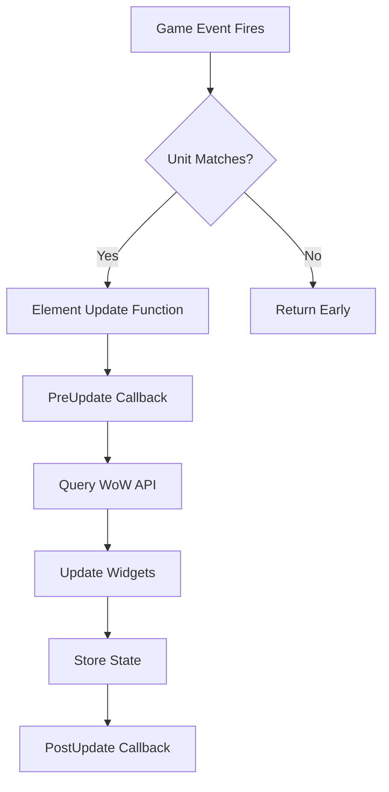

## What are Elements?

Elements are self-contained, reusable modules that handle specific aspects of unit frame functionality. Each element is responsible for:

- Displaying specific unit information (health, power, auras, etc.)
- Registering relevant game events
- Updating its display when events fire
- Managing its own widgets and state

```lua
-- Elements handle specific data
self.Health     -- Health bar element
self.Power      -- Power bar element  
self.Auras      -- Buff/debuff element
self.Castbar    -- Casting bar element
```

## Element Structure

Every element consists of three core functions:

### Enable Function

Called when the element is activated for a frame:

```lua
local function Enable(self, unit)
    local element = self.Health
    if element then
        element.__owner = self
        element.ForceUpdate = ForceUpdate
        
        -- Register events
        self:RegisterEvent('UNIT_HEALTH', Path)
        self:RegisterEvent('UNIT_MAXHEALTH', Path)
        
        -- Setup defaults
        if not element:GetStatusBarTexture() then
            element:SetStatusBarTexture('Interface\\TargetingFrame\\UI-StatusBar')
        end
        
        element:Show()
        return true  -- Success
    end
end
```

**Responsibilities:**
- Check if element widget exists (`self.Health`)
- Set up element properties and methods
- Register required game events
- Apply default settings
- Show the element
- Return `true` on success

### Update Function

Called when registered events fire:

```lua
local function Update(self, event, unit)
    if not unit or self.unit ~= unit then return end
    local element = self.Health
    
    -- PreUpdate callback
    if element.PreUpdate then
        element:PreUpdate(unit)
    end
    
    -- Fetch data from WoW API
    local cur = UnitHealth(unit)
    local max = UnitHealthMax(unit)
    
    -- Update widget
    element:SetMinMaxValues(0, max)
    element:SetValue(cur)
    
    -- Store values
    element.cur = cur
    element.max = max
    
    -- PostUpdate callback
    if element.PostUpdate then
        element:PostUpdate(unit, cur, max)
    end
end
```

**Responsibilities:**
- Validate unit matches frame's unit
- Call PreUpdate callback if defined
- Query WoW API for current data
- Update visual widgets
- Store state for external access
- Call PostUpdate callback

### Disable Function

Called when the element is deactivated:

```lua
local function Disable(self)
    local element = self.Health
    if element then
        element:Hide()
        
        -- Unregister all events
        self:UnregisterEvent('UNIT_HEALTH', Path)
        self:UnregisterEvent('UNIT_MAXHEALTH', Path)
        self:UnregisterEvent('UNIT_CONNECTION', Path)
    end
end
```

**Responsibilities:**
- Hide the element
- Unregister all events
- Clean up temporary state
- Release resources

## Element Registration

Register an element with `oUF:AddElement()`:

```lua
oUF:AddElement(name, update, enable, disable)
```

**Parameters:**
- `name` (string) - Unique element identifier
- `update` (function?) - Update function (can be nil)
- `enable` (function) - Enable function (required)
- `disable` (function) - Disable function (required)

**Example:**

```lua
-- Register the Health element
oUF:AddElement('Health', Update, Enable, Disable)
```

<Info>
Elements are registered globally and automatically enabled for all frames that have the corresponding widget (e.g., `self.Health`).
</Info>

## Element Lifecycle

### Automatic Activation

Elements activate automatically when:
1. A frame is initialized
2. The frame has the required widget
3. The element is registered globally

```lua
-- In initObject() - ouf.lua:328-331
activeElements[object] = {}
for element in next, elements do
    object:EnableElement(element, objectUnit)
end
```

### Conditional Enabling

Elements can check conditions before activating:

```lua
local function Enable(self, unit)
    local element = self.Power
    if element then
        -- Only enable for player
        if unit ~= 'player' then
            return false
        end
        
        -- Setup element...
        return true
    end
end
```

### Manual Control

Frames can manually control elements:

```lua
-- Enable element
frame:EnableElement('Health', 'player')

-- Check if enabled
if frame:IsElementEnabled('Health') then
    print('Health element is active')
end

-- Disable element
frame:DisableElement('Health')
```

## Element Update Flow



### Update Function Registration

Update functions are stored in `frame.__elements`:

```lua
-- EnableElement() - ouf.lua:100-106
if element.enable(self, unit or self.unit) then
    activeElements[self][name] = true
    
    if element.update then
        table.insert(self.__elements, element.update)
    end
end
```

### Bulk Updates

All elements update during `UpdateAllElements()`:

```lua
-- UpdateAllElements() - ouf.lua:183-212
for _, func in next, self.__elements do
    func(self, event, unit)
end
```

## Widget Requirements

Elements expect specific widget structures:

### Simple Widget

Most elements need a single widget:

```lua
-- Health expects self.Health to be a StatusBar
local Health = CreateFrame('StatusBar', nil, self)
Health:SetSize(250, 30)
self.Health = Health  -- Element will find and manage this
```

### Sub-Widgets

Complex elements use sub-widgets:

```lua
-- Health element with prediction sub-widgets
local Health = CreateFrame('StatusBar', nil, self)
self.Health = Health

-- Incoming healing bar
local HealingAll = CreateFrame('StatusBar', nil, Health)
HealingAll:SetPoint('LEFT', Health:GetStatusBarTexture(), 'RIGHT')
Health.HealingAll = HealingAll  -- Sub-widget

-- Damage absorb bar
local DamageAbsorb = CreateFrame('StatusBar', nil, Health)
DamageAbsorb:SetPoint('LEFT', HealingAll:GetStatusBarTexture(), 'RIGHT')
Health.DamageAbsorb = DamageAbsorb  -- Sub-widget
```

### Element Tables

Some elements are frame arrays:

```lua
-- ClassPower expects an array of widgets
local ClassPower = {}
for i = 1, 5 do
    ClassPower[i] = CreateFrame('StatusBar', nil, self)
    ClassPower[i]:SetSize(40, 10)
    ClassPower[i]:SetPoint('LEFT', (i-1) * 45, 0)
end
self.ClassPower = ClassPower
```

## Element Options

Elements support configuration through widget properties:

```lua
local Health = CreateFrame('StatusBar', nil, self)
self.Health = Health

-- Enable color options
Health.colorClass = true       -- Color by class
Health.colorReaction = true    -- Color by reaction
Health.colorHealth = true      -- Fallback to health color
Health.colorDisconnected = true -- Gray when offline

-- Smoothing option
Health.smoothing = Enum.StatusBarInterpolation.Smooth

-- Health prediction modes
Health.maximumHealthClampMode = Enum.UnitMaximumHealthMode.AbsorbedHealth
Health.incomingHealOverflow = 1.05  -- Allow 5% overflow
```

<Note>
Options are element-specific. Check each element's documentation for available options.
</Note>

## Element Callbacks

Elements provide hooks for customization:

### PreUpdate

Called before updating:

```lua
Health.PreUpdate = function(self, unit)
    -- Custom logic before update
    print('About to update health for', unit)
end
```

### PostUpdate

Called after updating:

```lua
Health.PostUpdate = function(self, unit, cur, max)
    -- Custom logic after update
    local percent = (cur / max) * 100
    if percent < 30 then
        self:SetStatusBarColor(1, 0, 0)  -- Red when low
    end
end
```

### Override Functions

Completely replace element behavior:

```lua
Health.Override = function(self, event, unit)
    -- Completely custom update logic
    local element = self.Health
    local cur = UnitHealth(unit)
    local max = UnitHealthMax(unit)
    
    -- Custom display logic
    element:SetMinMaxValues(0, max)
    element:SetValue(cur)
end
```

## Creating Custom Elements

Create your own elements following the pattern:

```lua
local _, ns = ...
local oUF = ns.oUF

local function Update(self, event, unit)
    if not unit or self.unit ~= unit then return end
    local element = self.MyCustomElement
    
    if element.PreUpdate then
        element:PreUpdate(unit)
    end
    
    -- Your custom logic
    local customData = GetCustomUnitData(unit)
    element:SetText(customData)
    
    if element.PostUpdate then
        element:PostUpdate(unit, customData)
    end
end

local function Path(self, ...)
    return (self.MyCustomElement.Override or Update)(self, ...)
end

local function ForceUpdate(element)
    return Path(element.__owner, 'ForceUpdate', element.__owner.unit)
end

local function Enable(self, unit)
    local element = self.MyCustomElement
    if element then
        element.__owner = self
        element.ForceUpdate = ForceUpdate
        
        -- Register events
        self:RegisterEvent('CUSTOM_EVENT', Path)
        
        element:Show()
        return true
    end
end

local function Disable(self)
    local element = self.MyCustomElement
    if element then
        element:Hide()
        self:UnregisterEvent('CUSTOM_EVENT', Path)
    end
end

-- Register the element
oUF:AddElement('MyCustomElement', Path, Enable, Disable)
```

## Real-World Example: Health Element

From `elements/health.lua`:

```lua
local function Enable(self, unit)
    local element = self.Health
    if element then
        element.__owner = self
        element.ForceUpdate = ForceUpdate
        
        -- Create prediction calculator
        if element.values then
            element.values:ResetPredictedValues()
        else
            element.values = CreateUnitHealPredictionCalculator()
        end
        
        -- Default smoothing
        if not element.smoothing then
            element.smoothing = Enum.StatusBarInterpolation.Immediate
        end
        
        -- Core events
        self:RegisterEvent('UNIT_HEALTH', Path)
        self:RegisterEvent('UNIT_MAXHEALTH', Path)
        self:RegisterEvent('UNIT_CONNECTION', Path)
        
        -- Party/raid events
        if unit == 'party' or unit == 'raid' then
            self:RegisterEvent('PARTY_MEMBER_ENABLE', Path)
            self:RegisterEvent('PARTY_MEMBER_DISABLE', Path)
        end
        
        -- Conditional events based on sub-widgets
        if element.HealingAll or element.HealingPlayer or element.HealingOther then
            self:RegisterEvent('UNIT_HEAL_PREDICTION', Path)
        end
        
        if element.DamageAbsorb then
            self:RegisterEvent('UNIT_ABSORB_AMOUNT_CHANGED', Path)
        end
        
        element:Show()
        return true
    end
end
```

This demonstrates:
- Widget validation
- Owner reference
- Prediction calculator setup
- Default values
- Core event registration
- Unit-specific events
- Sub-widget detection
- Conditional event registration

## Element Best Practices

<Tip>
**Design Principles**
- One element = one responsibility
- Always validate widget exists
- Check unit matches before updating
- Register only necessary events
- Provide sensible defaults
- Support customization via callbacks

**Event Management**
- Register events in Enable
- Unregister all events in Disable
- Use unit events for unit-specific data
- Handle unitless events explicitly

**Widget Updates**
- Validate data before setting
- Use smooth interpolation where appropriate
- Store values for external access
- Update sub-widgets consistently
</Tip>

## Common Patterns

### Color Management

```lua
local function UpdateColor(self, event, unit)
    if not unit or self.unit ~= unit then return end
    local element = self.Health
    
    local color
    if element.colorClass then
        local _, class = UnitClass(unit)
        color = self.colors.class[class]
    elseif element.colorReaction then
        local reaction = UnitReaction(unit, 'player')
        color = self.colors.reaction[reaction]
    end
    
    if color then
        element:SetStatusBarColor(color:GetRGB())
    end
end
```

### Conditional Sub-Widgets

```lua
local function Enable(self, unit)
    local element = self.Power
    if element then
        self:RegisterEvent('UNIT_POWER_UPDATE', Path)
        
        -- Optional cost prediction
        if element.CostPrediction then
            element.CostPrediction:Hide()
            if UnitIsUnit(unit, 'player') then
                self:RegisterEvent('UNIT_SPELLCAST_START', PredictionPath)
            end
        end
        
        return true
    end
end
```

### Force Update Method

```lua
local function ForceUpdate(element)
    Path(element.__owner, 'ForceUpdate', element.__owner.unit)
end

-- Usage in Enable
element.__owner = self
element.ForceUpdate = ForceUpdate

-- Layout can force updates
frame.Health:ForceUpdate()
```

## Next Steps

- Explore [available elements](/elements/health) in the element reference
- Learn about [Units](/concepts/units) for unit string handling
- Understand [Events](/concepts/events) for update triggers
- Check [Element Development](/guides/custom-elements) for creating custom elements